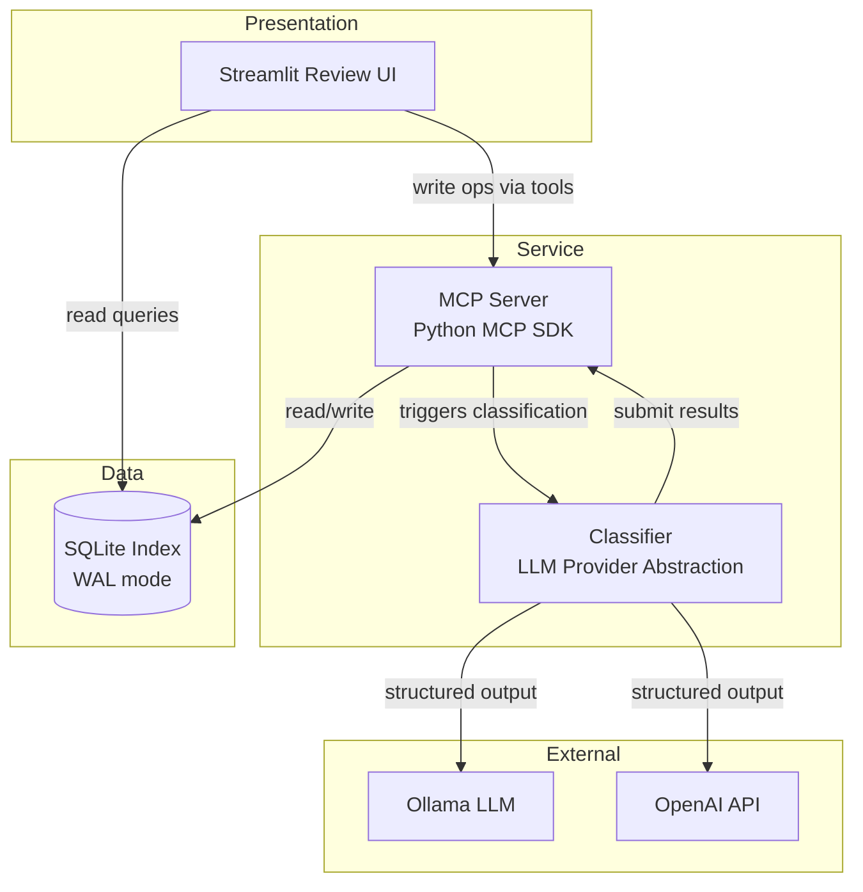
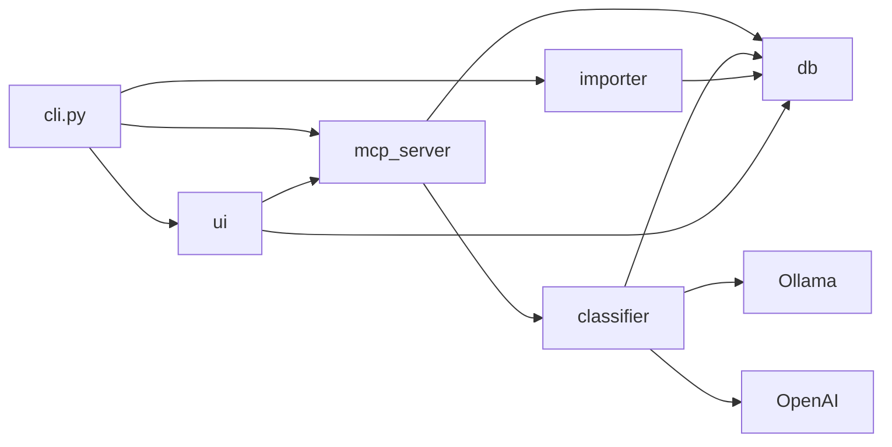
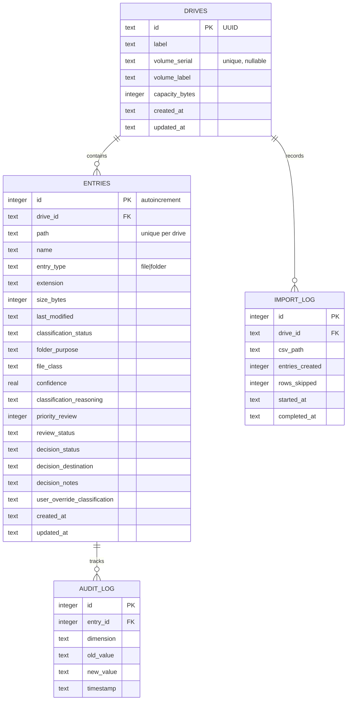
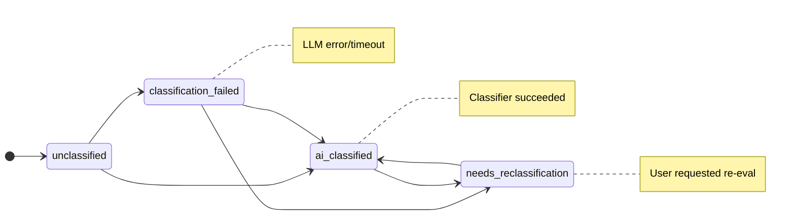
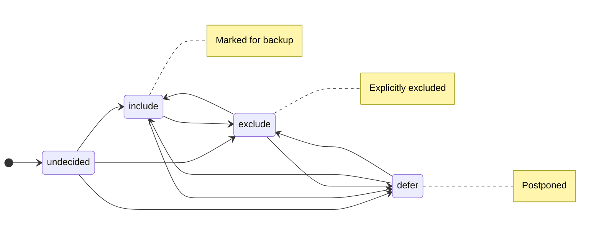

# Design Document — bakflow MVP

## Overview

The bakflow MVP is a Python-based system that helps users triage data across multiple hard drives through an AI-assisted classification and human review workflow. The system ingests directory listings via CSV import, classifies entries using a local LLM (Ollama), presents classifications for human review in a Streamlit UI, and exports decision manifests for manual backup execution.

The architecture follows a layered design:

1. **Data Layer** — SQLite database (the Index) as the single source of truth, with a Python module enforcing schema, status transitions, and audit logging.
2. **Service Layer** — MCP server exposing the Index as tools, plus a Classifier module that orchestrates LLM calls via Ollama.
3. **Presentation Layer** — Streamlit UI for human review, decision recording, and manifest export.

The MCP server sits between the AI agent and the data layer, providing a clean tool-based interface. The Streamlit UI talks directly to the data layer (shared SQLite access) for read-heavy operations, and calls MCP tools for write operations that require status transition enforcement.

### Key Design Decisions

| Decision | Choice | Rationale |
|---|---|---|
| Database | SQLite (single file) | Zero-config, portable, sufficient for single-user triage workloads. WAL mode for concurrent reads. |
| LLM integration | Provider abstraction (Ollama + OpenAI) with Pydantic structured outputs | Swappable backends via config. Ollama for local-first, OpenAI for higher accuracy. Both enforce JSON schema on responses. |
| MCP framework | `mcp` Python SDK (FastMCP pattern) | Official SDK, decorator-based tool registration, minimal boilerplate. Good learning vehicle. |
| UI framework | Streamlit | Rapid prototyping, built-in state management, good for data-centric review workflows. |
| Status enforcement | Application-layer Python module with SQLite triggers for audit | Keeps transition logic testable in Python; triggers handle audit logging at the DB level. |
| CSV format | TreeSize export (configurable column mapping) | Most common use case; column mapping dict allows adaptation to other tools. |



## Architecture

### Module Layout

```
src/
├── __init__.py
├── db/
│   ├── __init__.py
│   ├── schema.py          # DDL, migrations, index creation
│   ├── models.py          # Pydantic models for Drive, Entry, AuditLog, etc.
│   ├── repository.py      # CRUD operations, query builders
│   └── status.py          # Status transition validation & enforcement
├── importer/
│   ├── __init__.py
│   └── csv_importer.py    # TreeSize CSV parsing, column mapping, Entry creation
├── classifier/
│   ├── __init__.py
│   ├── provider.py        # Abstract LLMProvider protocol + factory function
│   ├── ollama_provider.py # Ollama implementation of LLMProvider
│   ├── openai_provider.py # OpenAI implementation of LLMProvider
│   ├── prompts.py         # Prompt templates for file and folder classification
│   └── batch.py           # Batch orchestration, confidence threshold logic
├── mcp_server/
│   ├── __init__.py
│   └── server.py          # MCP tool definitions, parameter validation, tool handlers
├── ui/
│   ├── __init__.py
│   ├── app.py             # Streamlit app entry point
│   ├── pages/
│   │   ├── drive_management.py
│   │   ├── review_queue.py
│   │   ├── progress_dashboard.py
│   │   └── export.py
│   └── components/
│       ├── entry_card.py
│       ├── filters.py
│       └── bulk_actions.py
├── config.py              # App configuration (DB path, LLM provider, model, thresholds)
└── cli.py                 # CLI entry points (run server, run UI, import CSV)
```

### Dependency Flow



All modules depend on `db/` for data access. The `classifier` depends on `db/` (to read entry data for prompt construction) and on an LLM provider (Ollama or OpenAI, selected via config). The `mcp_server` depends on `db/` and `classifier`. The `ui` depends on `db/` for reads and optionally on `mcp_server` for writes. The `importer` depends only on `db/`.

## Components and Interfaces

### 1. Database Layer (`db/`)

**`schema.py`** — Manages DDL and database initialization.

```python
def init_db(db_path: str) -> sqlite3.Connection:
    """Create tables, indexes, triggers. Enable WAL mode. Return connection."""
```

**`models.py`** — Pydantic models serving as the shared data contract.

```python
class Drive(BaseModel):
    id: str  # UUID
    label: str
    volume_serial: str | None = None
    volume_label: str | None = None
    capacity_bytes: int | None = None
    created_at: datetime
    updated_at: datetime

class Entry(BaseModel):
    id: int  # autoincrement
    drive_id: str  # FK → Drive.id
    path: str
    name: str
    entry_type: Literal["file", "folder"]
    extension: str | None = None
    size_bytes: int
    last_modified: datetime
    # Classification
    classification_status: ClassificationStatus = "unclassified"
    folder_purpose: str | None = None  # from Folder_Purpose_Taxonomy
    file_class: str | None = None
    confidence: float | None = None
    priority_review: bool = False
    # Review & Decision
    review_status: ReviewStatus = "pending_review"
    decision_status: DecisionStatus = "undecided"
    decision_destination: str | None = None
    decision_notes: str | None = None
    # Overrides
    user_override_classification: str | None = None
    created_at: datetime
    updated_at: datetime

class AuditLogEntry(BaseModel):
    id: int
    entry_id: int
    dimension: str  # "classification_status" | "review_status" | "decision_status"
    old_value: str
    new_value: str
    timestamp: datetime
```

**`status.py`** — Status transition enforcement.

```python
VALID_TRANSITIONS: dict[str, dict[str, set[str]]] = {
    "classification_status": {
        "unclassified": {"ai_classified", "classification_failed"},
        "classification_failed": {"ai_classified", "needs_reclassification"},
        "ai_classified": {"needs_reclassification"},
        "needs_reclassification": {"ai_classified"},
    },
    "review_status": {
        "pending_review": {"reviewed"},
        "reviewed": {"pending_review"},
    },
    "decision_status": {
        "undecided": {"include", "exclude", "defer"},
        "include": {"exclude", "defer"},
        "exclude": {"include", "defer"},
        "defer": {"include", "exclude"},
    },
}

CROSS_DIMENSION_GUARDS = {
    # review_status can only become "reviewed" if classification_status == "ai_classified"
    ("review_status", "reviewed"): lambda entry: entry.classification_status == "ai_classified",
}

def validate_transition(dimension: str, current: str, target: str, entry: Entry) -> None:
    """Raise InvalidTransitionError if the transition is not allowed."""

def apply_transition(conn: Connection, entry_id: int, dimension: str, target: str) -> Entry:
    """Validate, update the field, write audit log, return updated Entry."""
```

**`repository.py`** — Data access methods.

```python
class Repository:
    def __init__(self, conn: sqlite3.Connection): ...

    # Drives
    def create_drive(self, label: str, volume_serial: str | None, ...) -> Drive: ...
    def get_drive(self, drive_id: str) -> Drive | None: ...
    def get_drive_by_serial(self, volume_serial: str) -> Drive | None: ...
    def list_drives(self) -> list[Drive]: ...
    def update_drive_label(self, drive_id: str, label: str) -> Drive: ...

    # Entries
    def create_entries_bulk(self, entries: list[Entry]) -> int: ...
    def get_entry(self, entry_id: int) -> Entry | None: ...
    def get_entries_by_drive(self, drive_id: str, **filters) -> list[Entry]: ...
    def count_entries_by_drive(self, drive_id: str) -> int: ...

    # Batching
    def get_unclassified_batch(self, drive_id: str, batch_size: int) -> list[Entry]: ...
    def get_review_queue(self, drive_id: str, filters: dict) -> list[Entry]: ...

    # Progress
    def get_drive_progress(self, drive_id: str) -> dict: ...

    # Manifest
    def get_decision_manifest(self, drive_id: str, filters: dict) -> list[Entry]: ...

    # Children (for cascade)
    def get_child_entries(self, drive_id: str, parent_path: str) -> list[Entry]: ...
```

### 2. CSV Importer (`importer/`)

**`csv_importer.py`** — Parses TreeSize CSV exports and populates the Index.

```python
@dataclass
class ImportResult:
    drive_id: str
    drive_label: str
    entries_created: int
    rows_skipped: int
    skip_details: list[SkipDetail]  # row_number, reason

@dataclass
class ColumnMapping:
    path: str = "Path"
    name: str = "Name"
    size: str = "Size"
    last_modified: str = "Last Modified"
    entry_type: str = "Type"  # or inferred from extension/trailing slash

def import_csv(
    conn: Connection,
    csv_path: str,
    drive_id: str,
    column_mapping: ColumnMapping | None = None,
    force: bool = False,
) -> ImportResult:
    """
    Parse CSV, create Entry records.
    If drive already has entries and force=False, raise ConflictError.
    Skips malformed rows with warnings.
    """
```

The importer infers `entry_type` from the presence of a file extension when the CSV doesn't have an explicit type column. Each created Entry gets default statuses: `unclassified`, `pending_review`, `undecided`.

### 3. Classifier (`classifier/`)

**`provider.py`** — Abstract LLM provider protocol and factory.

```python
from typing import Protocol

class LLMProvider(Protocol):
    """Protocol that all LLM backends must implement."""

    async def classify_files(self, summaries: list[FileSummary]) -> list[FileClassification]:
        """Send file summaries, get back structured File_Class + confidence."""
        ...

    async def classify_folders(self, summaries: list[FolderSummary]) -> list[FolderClassification]:
        """Send folder summaries, get back structured Folder_Purpose + confidence."""
        ...

def create_provider(config: ClassifierConfig) -> LLMProvider:
    """Factory: returns OllamaProvider or OpenAIProvider based on config.provider."""
    if config.provider == "ollama":
        return OllamaProvider(model=config.model, base_url=config.base_url)
    elif config.provider == "openai":
        return OpenAIProvider(model=config.model, api_key=config.api_key)
    else:
        raise ValueError(f"Unknown LLM provider: {config.provider}")
```

**`ollama_provider.py`** — Ollama implementation.

```python
class OllamaProvider:
    """LLM provider using Ollama for local inference."""

    def __init__(self, model: str = "llama3.2", base_url: str = "http://localhost:11434"): ...

    async def classify_files(self, summaries: list[FileSummary]) -> list[FileClassification]:
        """Uses Ollama's format parameter with Pydantic JSON schema for structured output."""

    async def classify_folders(self, summaries: list[FolderSummary]) -> list[FolderClassification]:
        """Uses Ollama's format parameter with Pydantic JSON schema for structured output."""
```

**`openai_provider.py`** — OpenAI implementation.

```python
class OpenAIProvider:
    """LLM provider using OpenAI API (GPT-4o, etc.)."""

    def __init__(self, model: str = "gpt-4o-mini", api_key: str | None = None): ...

    async def classify_files(self, summaries: list[FileSummary]) -> list[FileClassification]:
        """Uses OpenAI's response_format with json_schema for structured output."""

    async def classify_folders(self, summaries: list[FolderSummary]) -> list[FolderClassification]:
        """Uses OpenAI's response_format with json_schema for structured output."""
```

Both providers use the same Pydantic response models and prompt templates — only the API call mechanism differs. The `LLMProvider` protocol ensures they're interchangeable.

Uses Pydantic models with `model_json_schema()` for guaranteed structured output on both backends:

```python
class FileClassification(BaseModel):
    entry_id: int
    file_class: str
    confidence: float = Field(ge=0.0, le=1.0)
    reasoning: str  # brief explanation from LLM

class FolderClassification(BaseModel):
    entry_id: int
    folder_purpose: Literal[
        "irreplaceable_personal", "important_personal", "project_or_work",
        "reinstallable_software", "media_archive", "redundant_duplicate",
        "system_or_temp", "unknown_review_needed"
    ]
    confidence: float = Field(ge=0.0, le=1.0)
    reasoning: str
```

**`prompts.py`** — Prompt templates.

```python
def build_file_classification_prompt(summaries: list[FileSummary]) -> str:
    """Build a prompt that presents file metadata and asks for File_Class labels."""

def build_folder_classification_prompt(summary: FolderSummary) -> str:
    """Build a prompt with folder contents summary, asking for Folder_Purpose."""
```

Prompts include the full taxonomy with descriptions so the LLM understands each category. Folder prompts include aggregated stats (file count, size distribution, extension breakdown, subfolder names).

**`batch.py`** — Batch orchestration.

```python
class BatchClassifier:
    def __init__(self, provider: LLMProvider, repo: Repository, config: ClassifierConfig): ...

    async def classify_batch(self, drive_id: str, batch_size: int = 50) -> BatchResult:
        """
        1. Fetch unclassified entries from repo
        2. Separate files and folders
        3. For folders: build folder summaries from child entries
        4. Send to LLMProvider (Ollama or OpenAI, transparent)
        5. Apply confidence threshold — flag low-confidence as priority_review
        6. Submit classifications back to repo via status transitions
        Returns BatchResult with counts and any failures.
        """
```

Classification flow:
1. Folders are classified first (their purpose informs child file classification).
2. Files are batched in groups (configurable, default 20 per LLM call) to balance throughput vs. context window.
3. Each LLM call is independent — a failure in one batch doesn't block others.
4. Entries that fail classification get `classification_status = classification_failed`.

### 4. MCP Server (`mcp_server/`)

**`server.py`** — Tool definitions using the MCP Python SDK.

```python
from mcp.server.fastmcp import FastMCP

mcp = FastMCP("bakflow")

@mcp.tool()
async def get_unclassified_batch(drive_id: str, batch_size: int = 50) -> list[dict]:
    """Get a batch of unclassified entries for a drive.
    
    Args:
        drive_id: UUID of the drive (also accepts volume serial number)
        batch_size: Maximum number of entries to return (default 50)
    """

@mcp.tool()
async def get_folder_summary(drive_id: str, path: str) -> dict:
    """Get an aggregated summary of folder contents.
    
    Args:
        drive_id: UUID of the drive
        path: Full path of the folder to summarize
    """

@mcp.tool()
async def submit_classification(classifications: list[dict]) -> dict:
    """Submit AI classification results for a batch of entries.
    
    Args:
        classifications: List of {entry_id, file_class|folder_purpose, confidence, reasoning}
    """

@mcp.tool()
async def classify_batch(drive_id: str, batch_size: int = 50) -> dict:
    """Fetch unclassified entries and classify them via the configured LLM.

    End-to-end operation: fetches unclassified entries, sends them to the
    LLM provider, writes results back to the database (status transitions
    and confidence-based priority_review flags).

    Args:
        drive_id: UUID of the drive (also accepts volume serial number)
        batch_size: Maximum number of entries to classify (default 50)
    """

@mcp.tool()
async def get_review_queue(
    drive_id: str,
    category: str | None = None,
    min_confidence: float | None = None,
    max_confidence: float | None = None,
    limit: int = 100,
    offset: int = 0,
) -> dict:
    """Get entries ready for human review, ordered by confidence ascending.
    
    Args:
        drive_id: UUID of the drive
        category: Filter by Folder_Purpose or File_Class
        min_confidence: Minimum confidence threshold
        max_confidence: Maximum confidence threshold
        limit: Page size
        offset: Pagination offset
    """

@mcp.tool()
async def record_decision(
    entry_id: int,
    decision: Literal["include", "exclude", "defer"],
    destination: str | None = None,
    notes: str | None = None,
    override_classification: str | None = None,
    cascade_to_children: bool = False,
    request_reclassification: bool = False,
) -> dict:
    """Record a backup decision for an entry.
    
    Args:
        entry_id: ID of the entry
        decision: include, exclude, or defer
        destination: Backup destination path (optional)
        notes: User notes (optional)
        override_classification: New classification to override AI suggestion (optional)
        cascade_to_children: Apply decision to undecided child entries (optional)
        request_reclassification: Mark related entries for reclassification after override (optional)
    """

@mcp.tool()
async def get_drive_progress(drive_id: str) -> dict:
    """Get triage progress for a drive across all status dimensions.
    
    Args:
        drive_id: UUID of the drive
    """

@mcp.tool()
async def get_decision_manifest(
    drive_id: str,
    decision_filter: str | None = "include",
) -> dict:
    """Get the decision manifest for export.
    
    Args:
        drive_id: UUID of the drive
        decision_filter: Filter by decision_status (default: include)
    """
```

Each tool handler:
1. Resolves drive identifier (UUID or volume serial lookup).
2. Validates parameters (returns structured error on failure).
3. Acquires a database connection from a connection pool.
4. Delegates to `Repository`, `status.py`, or `BatchClassifier` for data/classification operations.
5. Returns structured dict responses.

### 5. Streamlit UI (`ui/`)

**Pages:**

| Page | Purpose |
|---|---|
| `drive_management.py` | Register drives, edit labels, view hardware IDs, trigger CSV import |
| `review_queue.py` | Browse classified entries, filter/sort, approve/exclude/defer, bulk actions, cascade |
| `progress_dashboard.py` | Per-drive progress bars for each status dimension, overall completion % |
| `export.py` | Preview manifest, export as CSV or JSON, filter by decision status |

**`review_queue.py`** — The core review page.

- Sidebar filters: drive selector, category filter, confidence range slider, status filters.
- Main area: entries grouped by parent folder, expandable cards showing path, classification, confidence, size, last modified.
- Action buttons per entry: Include / Exclude / Defer, with optional destination and notes fields.
- Bulk selection: checkboxes + "Apply to selected" action bar.
- Cascade prompt: when a folder is decided, a dialog asks whether to cascade to undecided children.
- Override: dropdown to change the AI classification before recording a decision.

The UI reads directly from SQLite for display (fast, no MCP overhead) and writes through MCP tool calls (or directly through `Repository` + `status.py` — the status enforcement logic is in Python, not locked behind MCP).

## Data Models

### SQLite Schema

```sql
-- Enable WAL mode for concurrent read access
PRAGMA journal_mode=WAL;
PRAGMA foreign_keys=ON;

CREATE TABLE IF NOT EXISTS drives (
    id              TEXT PRIMARY KEY,  -- UUID
    label           TEXT NOT NULL,
    volume_serial   TEXT,
    volume_label    TEXT,
    capacity_bytes  INTEGER,
    created_at      TEXT NOT NULL DEFAULT (datetime('now')),
    updated_at      TEXT NOT NULL DEFAULT (datetime('now'))
);

CREATE UNIQUE INDEX IF NOT EXISTS idx_drives_volume_serial
    ON drives(volume_serial) WHERE volume_serial IS NOT NULL;

CREATE TABLE IF NOT EXISTS entries (
    id                      INTEGER PRIMARY KEY AUTOINCREMENT,
    drive_id                TEXT NOT NULL REFERENCES drives(id),
    path                    TEXT NOT NULL,
    name                    TEXT NOT NULL,
    entry_type              TEXT NOT NULL CHECK (entry_type IN ('file', 'folder')),
    extension               TEXT,
    size_bytes              INTEGER NOT NULL DEFAULT 0,
    last_modified           TEXT,

    -- Classification
    classification_status   TEXT NOT NULL DEFAULT 'unclassified'
        CHECK (classification_status IN (
            'unclassified', 'ai_classified', 'classification_failed', 'needs_reclassification'
        )),
    folder_purpose          TEXT CHECK (folder_purpose IS NULL OR folder_purpose IN (
        'irreplaceable_personal', 'important_personal', 'project_or_work',
        'reinstallable_software', 'media_archive', 'redundant_duplicate',
        'system_or_temp', 'unknown_review_needed'
    )),
    file_class              TEXT,
    confidence              REAL CHECK (confidence IS NULL OR (confidence >= 0.0 AND confidence <= 1.0)),
    classification_reasoning TEXT,
    priority_review         INTEGER NOT NULL DEFAULT 0,  -- boolean

    -- Review
    review_status           TEXT NOT NULL DEFAULT 'pending_review'
        CHECK (review_status IN ('pending_review', 'reviewed')),

    -- Decision
    decision_status         TEXT NOT NULL DEFAULT 'undecided'
        CHECK (decision_status IN ('undecided', 'include', 'exclude', 'defer')),
    decision_destination    TEXT,
    decision_notes          TEXT,

    -- Override
    user_override_classification TEXT,

    created_at              TEXT NOT NULL DEFAULT (datetime('now')),
    updated_at              TEXT NOT NULL DEFAULT (datetime('now')),

    UNIQUE(drive_id, path)
);

-- Query performance indexes
CREATE INDEX IF NOT EXISTS idx_entries_drive_classification
    ON entries(drive_id, classification_status);

CREATE INDEX IF NOT EXISTS idx_entries_drive_review
    ON entries(drive_id, review_status, classification_status);

CREATE INDEX IF NOT EXISTS idx_entries_drive_decision
    ON entries(drive_id, decision_status, review_status);

CREATE INDEX IF NOT EXISTS idx_entries_drive_path
    ON entries(drive_id, path);

CREATE INDEX IF NOT EXISTS idx_entries_confidence
    ON entries(confidence) WHERE classification_status = 'ai_classified';

-- Audit log
CREATE TABLE IF NOT EXISTS audit_log (
    id          INTEGER PRIMARY KEY AUTOINCREMENT,
    entry_id    INTEGER NOT NULL REFERENCES entries(id),
    dimension   TEXT NOT NULL,
    old_value   TEXT NOT NULL,
    new_value   TEXT NOT NULL,
    timestamp   TEXT NOT NULL DEFAULT (datetime('now'))
);

CREATE INDEX IF NOT EXISTS idx_audit_entry
    ON audit_log(entry_id);

-- Import log (tracks import operations)
CREATE TABLE IF NOT EXISTS import_log (
    id              INTEGER PRIMARY KEY AUTOINCREMENT,
    drive_id        TEXT NOT NULL REFERENCES drives(id),
    csv_path        TEXT NOT NULL,
    entries_created INTEGER NOT NULL,
    rows_skipped    INTEGER NOT NULL,
    started_at      TEXT NOT NULL,
    completed_at    TEXT NOT NULL DEFAULT (datetime('now'))
);

-- Trigger: auto-update updated_at on entries
CREATE TRIGGER IF NOT EXISTS trg_entries_updated_at
    AFTER UPDATE ON entries
    BEGIN
        UPDATE entries SET updated_at = datetime('now') WHERE id = NEW.id;
    END;

-- Trigger: auto-update updated_at on drives
CREATE TRIGGER IF NOT EXISTS trg_drives_updated_at
    AFTER UPDATE ON drives
    BEGIN
        UPDATE drives SET updated_at = datetime('now') WHERE id = NEW.id;
    END;
```

### Entity Relationship Diagram



### Status Transition Diagrams



```mermaid
stateDiagram-v2
    direction LR
    [*] --> pending_review
    pending_review --> reviewed
    reviewed --> pending_review

    note right of reviewed: Guard: classification_status must be ai_classified
    note left of pending_review: Reset on reclassification
```




## Correctness Properties

*A property is a characteristic or behavior that should hold true across all valid executions of a system — essentially, a formal statement about what the system should do. Properties serve as the bridge between human-readable specifications and machine-verifiable correctness guarantees.*

### Property 1: Drive registration produces valid records

*For any* user-provided label and optional hardware identifiers (volume serial, volume label, capacity), creating a Drive SHALL produce a record with a valid UUID, the exact label provided, and matching optional fields — and the Drive SHALL be retrievable from the Index by its UUID.

**Validates: Requirements 1.1**

### Property 2: CSV import round-trip

*For any* valid CSV content (with varying row counts, paths, sizes, timestamps, and entry types), importing it for a registered Drive SHALL create exactly one Entry per valid row, where each Entry's path, name, entry_type, extension, size_bytes, and last_modified match the CSV row, and each Entry has `classification_status = unclassified`, `review_status = pending_review`, `decision_status = undecided`. The returned ImportResult SHALL report entries_created equal to the number of valid rows, the correct Drive UUID and label.

**Validates: Requirements 1.2, 1.3, 1.6**

### Property 3: Malformed CSV rows are skipped without affecting valid rows

*For any* CSV containing a mix of valid and malformed rows (missing required fields, unparseable paths), the Importer SHALL create Entries only for valid rows, skip malformed rows, and the ImportResult SHALL report rows_skipped equal to the number of malformed rows with correct row numbers in skip_details.

**Validates: Requirements 1.4**

### Property 4: Drive lookup equivalence by UUID and volume serial

*For any* Drive registered with a non-null volume serial number, looking up the Drive by UUID and by volume serial SHALL return the same Drive record.

**Validates: Requirements 1.9**

### Property 5: Unclassified batch filtering and size limit

*For any* Drive with Entries in mixed classification statuses, `get_unclassified_batch(drive_id, batch_size)` SHALL return only Entries with `classification_status` in `{unclassified, needs_reclassification}`, and the number of returned Entries SHALL be at most `batch_size`.

**Validates: Requirements 2.1**

### Property 6: Folder summary aggregation correctness

*For any* folder path in a Drive, `get_folder_summary` SHALL return a file_count equal to the number of file Entries under that path, a total_size equal to the sum of their size_bytes, a file type distribution matching the actual extension counts, and a subfolder list matching the actual direct child folders.

**Validates: Requirements 2.2**

### Property 7: Classifier output completeness and validity

*For any* batch of Entries sent to the Classifier (with a mocked LLM), the Classifier SHALL return exactly one classification per input Entry, where each file Entry receives a non-empty file_class and each folder Entry receives a folder_purpose from the Folder_Purpose_Taxonomy, and every confidence value is in [0.0, 1.0].

**Validates: Requirements 2.3, 2.4, 2.8**

### Property 8: Classification submission round-trip

*For any* set of unclassified Entries and valid classification results, submitting the classifications via `submit_classification` SHALL update each Entry to have the submitted file_class or folder_purpose, the submitted confidence, and `classification_status = ai_classified`.

**Validates: Requirements 2.5**

### Property 9: Confidence threshold determines priority review flag

*For any* classified Entry, if its confidence is below the configured threshold then `priority_review` SHALL be True, and if its confidence is at or above the threshold then `priority_review` SHALL be False.

**Validates: Requirements 2.7**

### Property 10: Review queue filtering and ordering

*For any* Drive with Entries in mixed statuses, `get_review_queue(drive_id)` SHALL return only Entries where `classification_status = ai_classified` AND `review_status = pending_review`, and the returned Entries SHALL be ordered by confidence ascending (lowest first).

**Validates: Requirements 3.1**

### Property 11: Decision recording round-trip

*For any* Entry with `classification_status = ai_classified` and a valid decision (include, exclude, or defer), recording the decision SHALL set `review_status = reviewed` and `decision_status` to the chosen value, and the optional destination and notes SHALL be persisted exactly as provided.

**Validates: Requirements 3.4**

### Property 12: Cascade applies decision only to undecided children

*For any* folder Entry with child Entries in mixed decision states, cascading a decision SHALL update all children with `decision_status = undecided` to the cascaded decision, and SHALL leave children with any other decision_status unchanged.

**Validates: Requirements 3.7**

### Property 13: Decision manifest contains only matching entries

*For any* Drive with Entries in mixed review and decision states, `get_decision_manifest(drive_id, decision_filter)` SHALL return only Entries where `review_status = reviewed` AND `decision_status` matches the filter, and SHALL include each Entry's full source path, destination, classification, and notes.

**Validates: Requirements 4.1**

### Property 14: Export round-trip

*For any* decision manifest, exporting to CSV and parsing the CSV back SHALL recover all Entry records with correct source_path, destination_path, entry_type, classification, confidence, decision, and notes columns. The same SHALL hold for JSON export. The export header SHALL contain the correct Drive UUID, label, volume serial, export timestamp, and accurate counts of included, excluded, deferred, and undecided entries.

**Validates: Requirements 4.2, 4.3, 4.4**

### Property 15: Persistence round-trip

*For any* set of Drives and Entries with arbitrary status values, classifications, and decisions written to the Index, closing the database connection and reopening it SHALL yield identical data when queried.

**Validates: Requirements 5.1**

### Property 16: Progress aggregation correctness

*For any* Drive with Entries in known status distributions, `get_drive_progress` SHALL return counts per status dimension that exactly match the actual Entry counts, and the completion percentage SHALL equal the number of reviewed entries divided by total entries.

**Validates: Requirements 5.3**

### Property 17: Audit log completeness

*For any* status transition on any dimension (classification_status, review_status, decision_status), the system SHALL create an audit_log entry with the correct entry_id, dimension name, old_value, new_value, and a valid timestamp. Re-decisions on already-reviewed entries SHALL also produce audit log entries.

**Validates: Requirements 5.5, 7.6, 3.8**

### Property 18: Status transition enforcement

*For any* dimension (classification_status, review_status, decision_status) and any (current_value, target_value) pair, the transition SHALL succeed if and only if the pair appears in the valid transitions map. Invalid transitions SHALL be rejected with a descriptive error identifying the dimension, current value, and attempted value.

**Validates: Requirements 7.1, 7.2, 7.3, 7.5**

### Property 19: Cross-dimension guard enforcement

*For any* Entry where `classification_status ≠ ai_classified`, attempting to transition `review_status` to `reviewed` SHALL be rejected. The transition SHALL succeed only when `classification_status = ai_classified`.

**Validates: Requirements 7.4**

### Property 20: MCP tool parameter validation

*For any* MCP tool and any call with missing required parameters or parameters of invalid type/value, the tool SHALL return a structured error response describing the validation failure rather than raising an unhandled exception.

**Validates: Requirements 6.2**

## Error Handling

### Error Categories

| Category | Examples | Handling Strategy |
|---|---|---|
| **Import Errors** | Malformed CSV rows, missing columns, encoding issues | Skip row, log warning with row number and reason, continue processing. Report skip count in ImportResult. |
| **Conflict Errors** | Re-import on a drive that already has entries, duplicate volume serial | Raise `ConflictError` with descriptive message. Require explicit `force` flag or user confirmation. |
| **Transition Errors** | Invalid status transition, cross-dimension guard violation | Raise `InvalidTransitionError` with dimension, current value, attempted value. MCP tools return structured error. |
| **LLM Errors** | Ollama unreachable, OpenAI rate limit/auth failure, timeout, malformed response | Set affected entries to `classification_failed`. Return descriptive error. Do not block other batches. |
| **Validation Errors** | Missing MCP tool parameters, invalid types, out-of-range values | Return structured error response from MCP tool with field name and reason. |
| **Database Errors** | SQLite lock contention, disk full, corruption | Log error, return descriptive message. WAL mode minimizes lock contention for read/write concurrency. |

### Error Response Format (MCP Tools)

All MCP tools return errors in a consistent structure:

```python
{
    "error": {
        "code": "INVALID_TRANSITION",
        "message": "Cannot transition classification_status from 'unclassified' to 'needs_reclassification'",
        "details": {
            "dimension": "classification_status",
            "current_value": "unclassified",
            "attempted_value": "needs_reclassification"
        }
    }
}
```

### LLM Error Recovery

The Classifier handles LLM failures per-batch regardless of provider:
1. If the LLM provider is unreachable (Ollama down, OpenAI auth failure, rate limit), all entries in the batch get `classification_failed`.
2. If the LLM returns a response that doesn't match the Pydantic schema (despite structured output), the entry gets `classification_failed`.
3. Failed entries can be retried by fetching them again via `get_unclassified_batch` (they remain in `classification_failed`, which is eligible for re-classification via `classification_failed → ai_classified`).
4. Partial batch failures don't affect successfully classified entries in the same batch.
5. OpenAI-specific: rate limit errors trigger exponential backoff before marking entries as failed.

### Cascade Error Handling

When cascading a decision to children:
- Each child entry's transition is validated independently.
- If a child fails the cross-dimension guard (not yet `ai_classified`), it is skipped.
- The cascade result reports how many children were updated and how many were skipped with reasons.

## Testing Strategy

### Dual Testing Approach

The project uses both unit tests and property-based tests for comprehensive coverage:

- **Unit tests** (pytest): Specific examples, edge cases, integration points, error conditions.
- **Property-based tests** (Hypothesis): Universal properties across generated inputs, covering the 20 correctness properties defined above.

### Property-Based Testing Configuration

- **Library**: [Hypothesis](https://hypothesis.readthedocs.io/) (Python)
- **Minimum iterations**: 100 per property test (via `@settings(max_examples=100)`)
- **Tag format**: Each test is tagged with a comment: `# Feature: bakflow, Property {N}: {title}`
- **Each correctness property maps to exactly one property-based test**

### Test Organization

```
tests/
├── conftest.py              # Shared fixtures (in-memory SQLite, test drives, etc.)
├── unit/
│   ├── test_csv_importer.py     # Example-based import tests, edge cases
│   ├── test_status.py           # Example-based transition tests, error cases
│   ├── test_classifier.py       # Mocked LLM provider tests, error scenarios, provider switching
│   ├── test_mcp_tools.py        # Tool parameter validation, error responses
│   └── test_export.py           # Export format tests, edge cases
├── property/
│   ├── test_drive_properties.py       # P1, P4
│   ├── test_import_properties.py      # P2, P3
│   ├── test_classifier_properties.py  # P7, P8, P9
│   ├── test_query_properties.py       # P5, P6, P10, P13, P16
│   ├── test_decision_properties.py    # P11, P12
│   ├── test_export_properties.py      # P14
│   ├── test_persistence_properties.py # P15
│   ├── test_status_properties.py      # P17, P18, P19
│   └── test_mcp_validation_properties.py  # P20
└── integration/
    ├── test_mcp_server.py       # Smoke: all 8 tools registered (Req 6.1)
    ├── test_concurrency.py      # Concurrent MCP calls (Req 6.5)
    └── test_llm_integration.py  # Live provider tests: Ollama + OpenAI (optional, requires running services)
```

### Key Testing Strategies by Component

| Component | Unit Tests | Property Tests | Integration Tests |
|---|---|---|---|
| **CSV Importer** | Specific CSV formats, encoding edge cases, re-import conflict | P2 (round-trip), P3 (malformed rows) | — |
| **Status Engine** | Specific transition examples, error messages | P17 (audit), P18 (enforcement), P19 (guard) | — |
| **Classifier** | Provider unreachable, malformed response, timeout, provider switching | P7 (output validity), P8 (submission), P9 (threshold) | Live Ollama test, live OpenAI test (optional) |
| **MCP Tools** | Missing params, wrong types, specific error formats | P5, P6, P10, P13, P16, P20 | Smoke test (all tools registered), concurrency |
| **Repository** | Specific queries, empty results | P1 (drive creation), P4 (lookup), P15 (persistence) | — |
| **Export** | CSV column order, JSON structure, empty manifest | P14 (round-trip) | — |
| **Decisions** | Specific decision flows, cascade with no children | P11 (round-trip), P12 (cascade) | — |

### Hypothesis Custom Strategies

Key generators for property tests:

```python
# Example strategies (to be implemented in conftest.py)
from hypothesis import strategies as st

# Generate valid drive registration inputs
drives = st.builds(
    DriveInput,
    label=st.text(min_size=1, max_size=100),
    volume_serial=st.one_of(st.none(), st.text(min_size=1, max_size=50)),
    volume_label=st.one_of(st.none(), st.text(min_size=1, max_size=100)),
    capacity_bytes=st.one_of(st.none(), st.integers(min_value=0)),
)

# Generate valid CSV rows
csv_rows = st.lists(
    st.builds(
        CSVRow,
        path=st.from_regex(r"/[a-zA-Z0-9_/]+(\.[a-z]{1,4})?", fullmatch=True),
        size=st.integers(min_value=0, max_value=10**12),
        last_modified=st.datetimes(),
    ),
    min_size=1, max_size=200,
)

# Generate entries with random statuses
entry_statuses = st.builds(
    EntryStatus,
    classification=st.sampled_from(["unclassified", "ai_classified", "classification_failed", "needs_reclassification"]),
    review=st.sampled_from(["pending_review", "reviewed"]),
    decision=st.sampled_from(["undecided", "include", "exclude", "defer"]),
)

# Generate valid status transition attempts
transition_attempts = st.tuples(
    st.sampled_from(["classification_status", "review_status", "decision_status"]),
    st.sampled_from([...all status values...]),
    st.sampled_from([...all status values...]),
)
```
