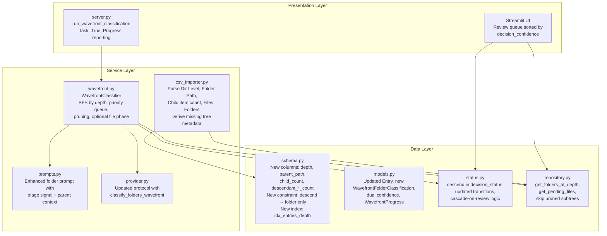
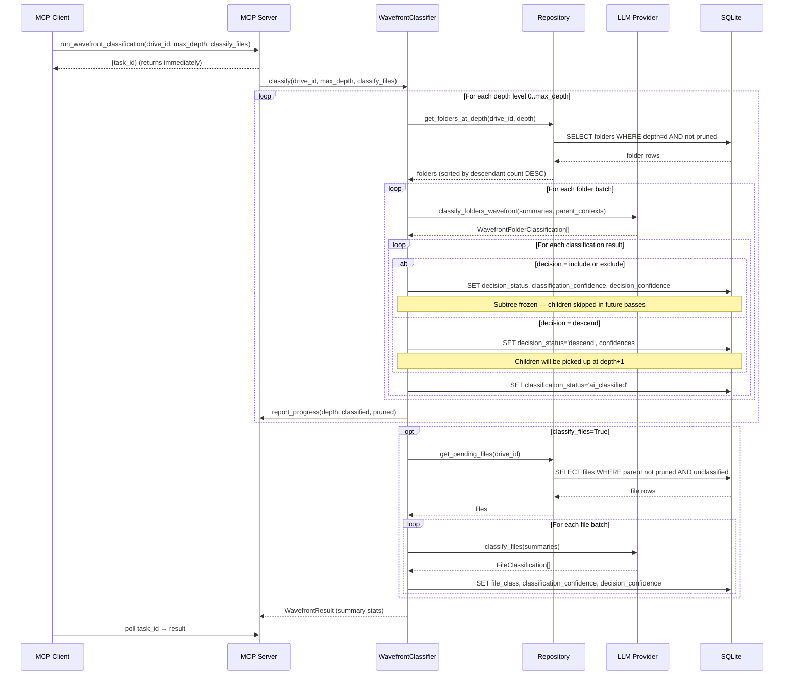
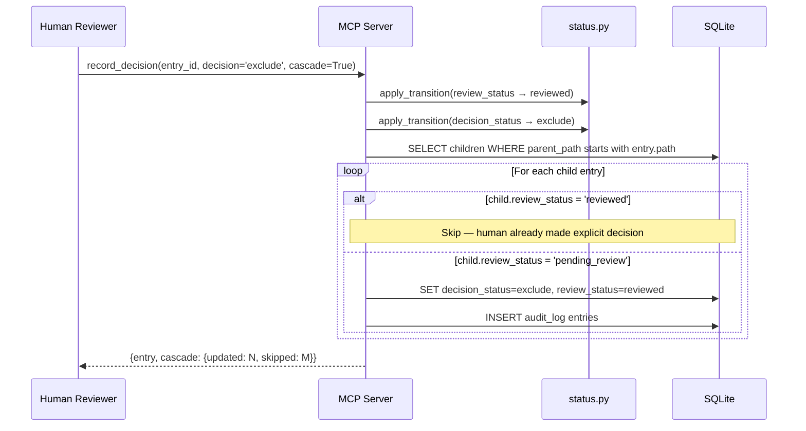

# Design Document: Wavefront Classification

## Overview

Wavefront classification replaces bakflow's flat batch classification with a tree-aware, breadth-first traversal strategy. Instead of classifying entries in arbitrary insertion order, the system walks the directory tree top-down by depth level, classifying folders first. Each folder classification produces a triage signal — `include`, `exclude`, or `descend` — that determines whether to prune the entire subtree or descend deeper. This dramatically reduces LLM calls by eliminating entire subtrees early (e.g., classifying `C:\Windows` as `exclude` at depth 1 prunes hundreds of thousands of system files).

The design touches every layer of the bakflow stack: schema (new columns, constraints, indexes), models (dual confidence, tree metadata), status engine (new `descend` value, updated transitions), repository (depth-based queries, pruning logic), importer (parse TreeSize tree columns), classifier (wavefront orchestrator replacing batch), prompts (triage signal + context propagation), provider protocol (new response model), MCP server (async background task with progress), and config (new wavefront parameters).

Key invariant: the wavefront never classifies an entry whose ancestor has a pending (unreviewed) `include` or `exclude` decision — those subtrees are frozen until the human confirms or overrides. Only `descend` signals cause the wavefront to continue deeper.

## Architecture



## Sequence Diagrams

### Wavefront Classification — Main Flow



### Cascade on Human Review



## Components and Interfaces

### Component 1: Schema Changes (`src/db/schema.py`)

**Purpose**: Extend the `entries` table with tree metadata columns, the `descend` decision status, dual confidence columns, and a depth-based index for wavefront queries.

**DDL Changes**:

```python
# New columns on entries table
"""
    -- Tree metadata (from TreeSize CSV or derived)
    depth                   INTEGER,          -- Dir Level from CSV, or derived from path
    parent_path             TEXT,             -- Folder Path from CSV, or derived from dirname
    child_count             INTEGER,          -- direct children (Child item count from CSV)
    descendant_file_count   INTEGER,          -- total files in subtree (Files from CSV)
    descendant_folder_count INTEGER,          -- total folders in subtree (Folders from CSV)
"""

# Updated decision_status CHECK constraint
"""
    decision_status TEXT NOT NULL DEFAULT 'undecided'
        CHECK (decision_status IN ('undecided', 'include', 'exclude', 'defer', 'descend')),
"""

# New CHECK constraint: descend only valid for folders
"""
    CHECK (decision_status != 'descend' OR entry_type = 'folder')
"""

# Rename confidence → classification_confidence, add decision_confidence
"""
    classification_confidence REAL CHECK (
        classification_confidence IS NULL
        OR (classification_confidence >= 0.0 AND classification_confidence <= 1.0)
    ),
    decision_confidence       REAL CHECK (
        decision_confidence IS NULL
        OR (decision_confidence >= 0.0 AND decision_confidence <= 1.0)
    ),
"""

# New index for wavefront depth traversal
"""
CREATE INDEX IF NOT EXISTS idx_entries_depth
    ON entries(drive_id, depth, classification_status, decision_status);
"""
```

**Responsibilities**:
- Define all DDL for new/modified columns
- Enforce `descend` → folder-only constraint at the database level
- Provide efficient depth-based querying via composite index
- All tree metadata columns are nullable (NULL = unknown, 0 = actually zero)

### Component 2: Pydantic Models (`src/db/models.py`)

**Purpose**: Update the `Entry` model for dual confidence and tree metadata. Add `WavefrontFolderClassification` for the enhanced LLM response. Add `WavefrontProgress` for progress reporting.

**Interface**:

```python
# Updated DecisionStatus literal
DecisionStatus = Literal["undecided", "include", "exclude", "defer", "descend"]

class Entry(BaseModel):
    # ... existing fields ...
    
    # Renamed: confidence → classification_confidence
    classification_confidence: float | None = None
    # New: decision confidence
    decision_confidence: float | None = None
    
    # Tree metadata (all nullable — NULL means unknown)
    depth: int | None = None
    parent_path: str | None = None
    child_count: int | None = None
    descendant_file_count: int | None = None
    descendant_folder_count: int | None = None


class WavefrontFolderClassification(BaseModel):
    """LLM output for wavefront folder classification with triage signal."""
    entry_id: int
    folder_purpose: Literal[
        "irreplaceable_personal", "important_personal", "project_or_work",
        "reinstallable_software", "media_archive", "redundant_duplicate",
        "system_or_temp", "unknown_review_needed",
    ]
    decision: Literal["include", "exclude", "descend"]
    classification_confidence: float = Field(ge=0.0, le=1.0)
    decision_confidence: float = Field(ge=0.0, le=1.0)
    reasoning: str  # Combined classification + decision reasoning


class WavefrontFolderSummary(BaseModel):
    """Enhanced folder summary with tree metadata and parent context."""
    entry_id: int
    path: str
    name: str
    depth: int
    size_bytes: int
    child_count: int | None = None
    descendant_file_count: int | None = None
    descendant_folder_count: int | None = None
    file_type_distribution: dict[str, int]
    subfolder_names: list[str]
    parent_classification: str | None = None  # Parent's folder_purpose
    parent_decision: str | None = None        # Parent's decision_status


class WavefrontProgress(BaseModel):
    """Progress snapshot for a running wavefront classification."""
    current_depth: int
    max_depth: int | None
    folders_classified: int
    folders_pruned: int
    files_classified: int
    total_folders: int
    total_files: int
    estimated_llm_calls_saved: int


class WavefrontResult(BaseModel):
    """Final result of a wavefront classification run."""
    drive_id: str
    depths_processed: int
    folders_classified: int
    folders_pruned: int
    files_classified: int
    files_skipped: int
    total_llm_calls: int
    estimated_calls_saved: int
    errors: list[str] = Field(default_factory=list)
```

**Responsibilities**:
- Serve as the canonical data contract for all wavefront operations
- Validate dual confidence values at the Pydantic level
- Carry parent context for context-propagation in prompts
- Track progress and results for async task reporting

### Component 3: Status Engine (`src/db/status.py`)

**Purpose**: Add `descend` to decision_status transitions, update cross-dimension guards, enforce the descend-folder-only constraint at the application level.

**Interface**:

```python
# Updated VALID_TRANSITIONS for decision_status
VALID_TRANSITIONS["decision_status"] = {
    "undecided": {"include", "exclude", "defer", "descend"},
    "include": {"exclude", "defer", "descend", "undecided"},
    "exclude": {"include", "defer", "descend", "undecided"},
    "defer": {"include", "exclude", "descend", "undecided"},
    "descend": {"include", "exclude", "defer", "undecided"},
}

# New cross-dimension guard: descend only for folders
CROSS_DIMENSION_GUARDS[("decision_status", "descend")] = (
    lambda entry: entry.entry_type == "folder"
)
```

**Responsibilities**:
- Allow full bidirectional transitions between all decision statuses for folders
- Enforce `descend` → folder-only at the application level (defense-in-depth with DB CHECK)
- Cascade logic: on `review_status → reviewed`, propagate parent decision to children (except already-reviewed children)

### Component 4: Repository (`src/db/repository.py`)

**Purpose**: Add depth-based queries for the wavefront traversal, pruning-aware child queries, and tree metadata derivation.

**Interface**:

```python
class Repository:
    def get_folders_at_depth(
        self,
        drive_id: str,
        depth: int,
        *,
        exclude_pruned: bool = True,
    ) -> list[Entry]:
        """Return folders at a specific depth level, excluding those under pruned ancestors.
        
        Ordered by descendant_file_count DESC (NULLS LAST) for large-subtree-first priority.
        Only returns folders where classification_status = 'unclassified' 
        (or 'needs_reclassification') AND no ancestor has a pending include/exclude decision.
        """
        ...

    def get_pending_files(
        self,
        drive_id: str,
        *,
        batch_size: int = 50,
    ) -> list[Entry]:
        """Return unclassified files whose parent folders are not pruned.
        
        A file is 'not pruned' if no ancestor folder has decision_status 
        IN ('include', 'exclude') with review_status = 'pending_review',
        AND no ancestor has decision_status IN ('include', 'exclude') 
        with review_status = 'reviewed'.
        """
        ...

    def get_pruned_ancestor(self, drive_id: str, path: str) -> Entry | None:
        """Check if any ancestor of the given path has a terminal decision (include/exclude).
        
        Returns the nearest pruned ancestor Entry, or None if the path is reachable.
        """
        ...

    def get_parent_entry(self, drive_id: str, parent_path: str) -> Entry | None:
        """Fetch the parent folder entry for context propagation."""
        ...

    def compute_tree_metadata(self, drive_id: str) -> int:
        """Derive depth, parent_path, child_count, descendant_*_count from the entries table.
        
        Used as a post-import step when the CSV didn't include TreeSize columns.
        Returns the number of entries updated.
        """
        ...

    def count_folders_at_depth(self, drive_id: str, depth: int) -> int:
        """Count total folders at a depth level (for progress reporting)."""
        ...

    def get_max_depth(self, drive_id: str) -> int:
        """Return the maximum depth value across all entries for a drive."""
        ...
```

**Responsibilities**:
- Efficient depth-level queries using the composite index
- Pruning-aware filtering: skip entries under ancestors with terminal decisions
- Large-subtree-first ordering within each depth level
- Tree metadata derivation for CSVs without TreeSize columns

### Component 5: CSV Importer (`src/importer/csv_importer.py`)

**Purpose**: Parse new TreeSize CSV columns (`Dir Level`, `Folder Path`, `Child item count`, `Files`, `Folders`) and populate tree metadata. Derive missing metadata from path structure.

**Interface**:

```python
@dataclass
class ColumnMapping:
    # ... existing fields ...
    dir_level: str = "Dir Level"
    folder_path: str = "Folder Path"
    child_item_count: str = "Child item count"
    files_count: str = "Files"
    folders_count: str = "Folders"
```

**Responsibilities**:
- Detect presence of tree metadata columns in CSV headers
- Parse and store `depth`, `parent_path`, `child_count`, `descendant_file_count`, `descendant_folder_count`
- When columns are absent: derive `depth` from path separator count, `parent_path` from dirname
- Leave `child_count`, `descendant_file_count`, `descendant_folder_count` as NULL when not available (trigger post-import computation)
- Parse integer values, handling TreeSize's space-separated thousands format

### Component 6: Wavefront Classifier (`src/classifier/wavefront.py`)

**Purpose**: Replace `BatchClassifier` with a tree-aware, depth-first wavefront traversal that classifies folders top-down and prunes subtrees early.

**Interface**:

```python
@dataclass
class WavefrontConfig:
    """Configuration for wavefront classification."""
    max_depth: int | None = None        # None = no limit, process all depths
    classify_files: bool = True          # Whether to classify individual files after folder pass
    batch_size: int = 10                 # Folders per LLM call
    confidence_threshold: float = 0.7    # Below this → priority_review


class WavefrontClassifier:
    def __init__(
        self,
        provider: LLMProvider,
        repo: Repository,
        conn: sqlite3.Connection,
        config: WavefrontConfig,
    ) -> None: ...

    async def classify(
        self,
        drive_id: str,
        progress_callback: Callable[[WavefrontProgress], None] | None = None,
    ) -> WavefrontResult:
        """Run the full wavefront classification for a drive."""
        ...
```

**Responsibilities**:
- BFS traversal by depth level (0, 1, 2, ...)
- Within each depth: sort folders by `descendant_file_count` DESC (large subtrees first)
- For each folder: build `WavefrontFolderSummary` with parent context
- Submit to LLM, process triage signal
- `include`/`exclude` → mark folder, subtree frozen for future passes
- `descend` → mark folder, children eligible at next depth
- After folder pass: optionally classify remaining files
- Report progress via callback at each depth level
- Track estimated LLM calls saved (sum of descendant counts for pruned folders)

### Component 7: Enhanced Prompts (`src/classifier/prompts.py`)

**Purpose**: Build folder classification prompts that request a triage signal (`include`/`exclude`/`descend`) alongside the folder purpose, with parent context propagation.

**Interface**:

```python
def build_wavefront_folder_prompt(summary: WavefrontFolderSummary) -> str:
    """Build a prompt for wavefront folder classification.
    
    Includes:
    - Folder purpose taxonomy
    - Triage signal explanation (include/exclude/descend)
    - Tree metadata (child count, descendant counts)
    - Parent classification context (if available)
    - Request for dual confidence scores
    - Combined reasoning for both classification and decision
    """
    ...
```

**Responsibilities**:
- Explain the three triage signals clearly to the LLM
- Include tree size metadata to help the LLM make pruning decisions
- Propagate parent folder's classification as context
- Request structured JSON with `folder_purpose`, `decision`, `classification_confidence`, `decision_confidence`, `reasoning`

### Component 8: Provider Protocol (`src/classifier/provider.py`)

**Purpose**: Extend the `LLMProvider` protocol with a wavefront-specific folder classification method.

**Interface**:

```python
@runtime_checkable
class LLMProvider(Protocol):
    # ... existing methods ...

    async def classify_folders_wavefront(
        self,
        summaries: list[WavefrontFolderSummary],
    ) -> list[WavefrontFolderClassification]:
        """Classify folders with triage signal for wavefront traversal."""
        ...
```

**Responsibilities**:
- Define the protocol method that all LLM backends must implement
- Accept `WavefrontFolderSummary` (with tree metadata and parent context)
- Return `WavefrontFolderClassification` (with dual confidence and triage signal)

### Component 9: MCP Server (`src/mcp_server/server.py`)

**Purpose**: Expose wavefront classification as an async background task with progress reporting. Update cascade logic and manifest filtering.

**Interface**:

```python
@mcp.tool(task=True)
async def run_wavefront_classification(
    drive_id: str,
    max_depth: int | None = None,
    classify_files: bool = True,
    batch_size: int = 10,
    ctx: Context = None,
) -> dict:
    """Run tree-aware wavefront classification as a background task.
    
    Returns immediately with a task_id. Poll for progress/result.
    Reports progress: current depth, folders classified, folders pruned.
    """
    ...
```

**Responsibilities**:
- Register as `task=True` for background execution via FastMCP
- Use `ctx.report_progress()` for real-time progress updates
- Update `record_decision` to handle `descend` as a valid decision
- Update cascade logic: cascade on review confirmation, skip already-reviewed children
- Update `get_decision_manifest` to exclude `descend` entries (intermediate routing decisions)
- Update `get_review_queue` to sort by `decision_confidence` ASC

### Component 10: Configuration (`src/config.py`)

**Purpose**: Add wavefront-specific configuration options.

**Interface**:

```python
@dataclass
class AppConfig:
    # ... existing fields ...
    wavefront_max_depth: int | None = field(
        default_factory=lambda: _env_int_optional("BF_WAVEFRONT_MAX_DEPTH")
    )
    wavefront_classify_files: bool = field(
        default_factory=lambda: _env("BF_WAVEFRONT_CLASSIFY_FILES", "true").lower() == "true"
    )
    wavefront_batch_size: int = field(
        default_factory=lambda: int(_env("BF_WAVEFRONT_BATCH_SIZE", "10"))
    )
```

## Data Models

### Updated `entries` Table Schema

```sql
CREATE TABLE IF NOT EXISTS entries (
    id                      INTEGER PRIMARY KEY AUTOINCREMENT,
    drive_id                TEXT NOT NULL REFERENCES drives(id),
    path                    TEXT NOT NULL,
    original_path           TEXT NOT NULL DEFAULT '',
    name                    TEXT NOT NULL,
    entry_type              TEXT NOT NULL CHECK (entry_type IN ('file', 'folder')),
    extension               TEXT,
    size_bytes              INTEGER NOT NULL DEFAULT 0,
    last_modified           TEXT,

    -- Tree metadata (nullable: NULL = unknown, 0 = actually zero)
    depth                   INTEGER,
    parent_path             TEXT,
    child_count             INTEGER,
    descendant_file_count   INTEGER,
    descendant_folder_count INTEGER,

    -- Classification
    classification_status   TEXT NOT NULL DEFAULT 'unclassified'
        CHECK (classification_status IN (
            'unclassified', 'ai_classified', 'classification_failed', 'needs_reclassification'
        )),
    folder_purpose          TEXT CHECK (folder_purpose IS NULL OR folder_purpose IN (
        'irreplaceable_personal', 'important_personal', 'project_or_work',
        'reinstallable_software', 'media_archive', 'redundant_duplicate',
        'system_or_temp', 'unknown_review_needed'
    )),
    file_class              TEXT,
    classification_confidence REAL CHECK (
        classification_confidence IS NULL
        OR (classification_confidence >= 0.0 AND classification_confidence <= 1.0)
    ),
    decision_confidence     REAL CHECK (
        decision_confidence IS NULL
        OR (decision_confidence >= 0.0 AND decision_confidence <= 1.0)
    ),
    classification_reasoning TEXT,
    priority_review         INTEGER NOT NULL DEFAULT 0,

    -- Review
    review_status           TEXT NOT NULL DEFAULT 'pending_review'
        CHECK (review_status IN ('pending_review', 'reviewed')),

    -- Decision
    decision_status         TEXT NOT NULL DEFAULT 'undecided'
        CHECK (decision_status IN ('undecided', 'include', 'exclude', 'defer', 'descend')),
    decision_destination    TEXT,
    decision_notes          TEXT,

    -- Override
    user_override_classification TEXT,

    created_at              TEXT NOT NULL DEFAULT (datetime('now')),
    updated_at              TEXT NOT NULL DEFAULT (datetime('now')),

    UNIQUE(drive_id, path),
    CHECK (decision_status != 'descend' OR entry_type = 'folder')
);
```

**Validation Rules**:
- `depth` ≥ 0 when not NULL
- `parent_path` is NULL for root entries (depth = 0)
- `child_count`, `descendant_file_count`, `descendant_folder_count` are NULL (unknown) or ≥ 0
- `descend` decision_status is only valid when `entry_type = 'folder'`
- `classification_confidence` and `decision_confidence` are independent — both in [0.0, 1.0] or NULL

## Algorithmic Pseudocode

### Main Wavefront Algorithm

```python
async def classify(self, drive_id: str, progress_callback=None) -> WavefrontResult:
    """
    ALGORITHM: Wavefront Classification (BFS by depth)
    
    INPUT:  drive_id, max_depth (optional), classify_files flag
    OUTPUT: WavefrontResult with classification stats
    
    PRECONDITIONS:
      - Drive exists and has entries with depth populated
      - No concurrent wavefront classification running for this drive
      - LLM provider is available and configured
    
    POSTCONDITIONS:
      - All reachable folders up to max_depth have classification_status = 'ai_classified'
      - Folders with include/exclude have their subtrees frozen (not classified)
      - Folders with descend have their children eligible for next depth
      - If classify_files=True, all reachable files are classified
      - Every classified entry has both classification_confidence and decision_confidence set
      - Audit log contains a record for every status transition
    
    LOOP INVARIANT (depth loop):
      - All folders at depths < current_depth are classified or under a pruned ancestor
      - No entry under a pruned ancestor has been sent to the LLM
      - folders_pruned + folders_classified + folders_remaining = total_folders
    """
    result = WavefrontResult(drive_id=drive_id)
    max_d = self.config.max_depth or self.repo.get_max_depth(drive_id)
    
    for depth in range(0, max_d + 1):
        folders = self.repo.get_folders_at_depth(
            drive_id, depth, exclude_pruned=True
        )
        # INVARIANT: folders contains only entries where:
        #   - no ancestor has decision_status IN ('include', 'exclude')
        #   - classification_status IN ('unclassified', 'needs_reclassification')
        
        if not folders:
            continue
        
        # Sort by descendant count DESC — prune large subtrees first
        folders.sort(
            key=lambda f: (f.descendant_file_count or 0),
            reverse=True,
        )
        
        for batch in batched(folders, self.config.batch_size):
            summaries = [self._build_wavefront_summary(f) for f in batch]
            classifications = await self.provider.classify_folders_wavefront(summaries)
            
            for folder, classification in zip(batch, classifications):
                self._apply_folder_classification(folder, classification)
                
                if classification.decision in ("include", "exclude"):
                    # Subtree pruned — count saved LLM calls
                    result.folders_pruned += 1
                    result.estimated_calls_saved += (
                        (folder.descendant_file_count or 0)
                        + (folder.descendant_folder_count or 0)
                    )
                else:  # descend
                    pass  # Children become eligible at depth + 1
                
                result.folders_classified += 1
        
        result.depths_processed = depth + 1
        
        if progress_callback:
            progress_callback(WavefrontProgress(
                current_depth=depth,
                max_depth=max_d,
                folders_classified=result.folders_classified,
                folders_pruned=result.folders_pruned,
                files_classified=result.files_classified,
                total_folders=self.repo.count_folders_at_depth(drive_id, depth),
                total_files=0,
                estimated_llm_calls_saved=result.estimated_calls_saved,
            ))
    
    # Phase 2: Classify remaining files (optional)
    if self.config.classify_files:
        await self._classify_remaining_files(drive_id, result, progress_callback)
    
    return result
```

### Pruning Check Algorithm

```python
def get_folders_at_depth(
    self, drive_id: str, depth: int, *, exclude_pruned: bool = True
) -> list[Entry]:
    """
    ALGORITHM: Fetch classifiable folders at a depth level, excluding pruned subtrees.
    
    INPUT:  drive_id, depth, exclude_pruned flag
    OUTPUT: List of Entry (folders) at the given depth that are eligible for classification
    
    PRECONDITIONS:
      - depth >= 0
      - entries table has depth column populated for this drive
    
    POSTCONDITIONS:
      - All returned entries have entry_type = 'folder' AND depth = depth
      - All returned entries have classification_status IN ('unclassified', 'needs_reclassification')
      - If exclude_pruned: no returned entry has an ancestor with
        decision_status IN ('include', 'exclude')
      - Results ordered by descendant_file_count DESC NULLS LAST
    """
    sql = """
        SELECT e.* FROM entries e
        WHERE e.drive_id = ?
          AND e.depth = ?
          AND e.entry_type = 'folder'
          AND e.classification_status IN ('unclassified', 'needs_reclassification')
    """
    
    if exclude_pruned:
        # Exclude folders whose parent_path prefix matches any ancestor
        # with a terminal decision (include or exclude)
        sql += """
          AND NOT EXISTS (
              SELECT 1 FROM entries ancestor
              WHERE ancestor.drive_id = e.drive_id
                AND ancestor.entry_type = 'folder'
                AND ancestor.decision_status IN ('include', 'exclude')
                AND e.path LIKE ancestor.path || '%'
                AND ancestor.path != e.path
          )
        """
    
    sql += " ORDER BY COALESCE(e.descendant_file_count, 0) DESC"
    
    # ... execute and return entries ...
```

### Apply Folder Classification Algorithm

```python
def _apply_folder_classification(
    self,
    folder: Entry,
    classification: WavefrontFolderClassification,
) -> None:
    """
    ALGORITHM: Apply a wavefront classification result to a folder entry.
    
    INPUT:  folder Entry, WavefrontFolderClassification from LLM
    OUTPUT: Updated database row with classification and decision
    
    PRECONDITIONS:
      - folder.classification_status IN ('unclassified', 'needs_reclassification')
      - folder.entry_type = 'folder'
      - classification.decision IN ('include', 'exclude', 'descend')
      - classification.classification_confidence IN [0.0, 1.0]
      - classification.decision_confidence IN [0.0, 1.0]
    
    POSTCONDITIONS:
      - folder.classification_status = 'ai_classified'
      - folder.folder_purpose = classification.folder_purpose
      - folder.decision_status = classification.decision
      - folder.classification_confidence = classification.classification_confidence
      - folder.decision_confidence = classification.decision_confidence
      - folder.classification_reasoning = classification.reasoning
      - folder.priority_review = (classification.decision_confidence < threshold)
      - folder.review_status remains 'pending_review' (human must confirm)
      - Audit log has entries for classification_status and decision_status transitions
    """
    priority = classification.decision_confidence < self.config.confidence_threshold
    
    self.conn.execute(
        """UPDATE entries SET
            folder_purpose = ?,
            classification_confidence = ?,
            decision_confidence = ?,
            classification_reasoning = ?,
            priority_review = ?
        WHERE id = ?""",
        (
            classification.folder_purpose,
            classification.classification_confidence,
            classification.decision_confidence,
            classification.reasoning,
            int(priority),
            folder.id,
        ),
    )
    self.conn.commit()
    
    # Transition classification_status → ai_classified
    apply_transition(self.conn, folder.id, "classification_status", "ai_classified")
    # Transition decision_status → include/exclude/descend
    apply_transition(self.conn, folder.id, "decision_status", classification.decision)
```

### Cascade on Review Confirmation Algorithm

```python
def cascade_decision_on_review(
    conn: sqlite3.Connection,
    repo: Repository,
    parent: Entry,
    decision: str,
    destination: str | None,
    notes: str | None,
) -> dict:
    """
    ALGORITHM: Cascade a confirmed decision to all descendants.
    
    INPUT:  parent Entry (just reviewed), decision, destination, notes
    OUTPUT: dict with updated/skipped counts
    
    PRECONDITIONS:
      - parent.review_status = 'reviewed' (just transitioned)
      - parent.decision_status IN ('include', 'exclude')
      - decision != 'descend' (descend doesn't cascade)
    
    POSTCONDITIONS:
      - All descendant entries where review_status != 'reviewed' have:
        - decision_status = decision
        - review_status = 'reviewed'
        - decision_destination = destination
        - decision_notes = notes
      - Descendant entries where review_status = 'reviewed' are UNCHANGED
        (human already made explicit decision — respect it)
      - Audit log records all transitions
    
    LOOP INVARIANT:
      - For each processed child: either it was skipped (already reviewed)
        or it now has the parent's decision applied
    """
    children = repo.get_child_entries(parent.drive_id, parent.path)
    updated = 0
    skipped = 0
    
    for child in children:
        if child.review_status == "reviewed":
            # Human already made explicit decision — don't override
            skipped += 1
            continue
        
        # Apply parent's decision to this child
        conn.execute(
            """UPDATE entries SET
                decision_status = ?,
                review_status = 'reviewed',
                decision_destination = ?,
                decision_notes = ?
            WHERE id = ?""",
            (decision, destination, notes, child.id),
        )
        conn.execute(
            "INSERT INTO audit_log (entry_id, dimension, old_value, new_value) VALUES (?, ?, ?, ?)",
            (child.id, "decision_status", child.decision_status, decision),
        )
        conn.execute(
            "INSERT INTO audit_log (entry_id, dimension, old_value, new_value) VALUES (?, ?, ?, ?)",
            (child.id, "review_status", child.review_status, "reviewed"),
        )
        conn.commit()
        updated += 1
    
    return {"updated": updated, "skipped": skipped}
```

### Tree Metadata Derivation Algorithm

```python
def compute_tree_metadata(self, drive_id: str) -> int:
    """
    ALGORITHM: Derive tree metadata from path structure when CSV columns are absent.
    
    INPUT:  drive_id
    OUTPUT: Number of entries updated
    
    PRECONDITIONS:
      - Entries exist for drive_id with path column populated
      - depth, parent_path may be NULL (not yet computed)
    
    POSTCONDITIONS:
      - All entries have depth set (count of '/' separators minus 1, or from path structure)
      - All non-root entries have parent_path set (dirname of path)
      - child_count set for all folders (count of direct children)
      - descendant_file_count set for all folders (recursive file count)
      - descendant_folder_count set for all folders (recursive folder count)
    """
    # Step 1: Derive depth from path separators
    self.conn.execute("""
        UPDATE entries
        SET depth = LENGTH(path) - LENGTH(REPLACE(path, '/', '')) - 1
        WHERE drive_id = ? AND depth IS NULL
    """, (drive_id,))
    
    # Step 2: Derive parent_path from dirname
    self.conn.execute("""
        UPDATE entries
        SET parent_path = CASE
            WHEN path LIKE '%/%/%' THEN SUBSTR(path, 1, LENGTH(path) - LENGTH(
                REPLACE(RTRIM(path, '/'), '/', '')
            ) - 1)
            ELSE NULL
        END
        WHERE drive_id = ? AND parent_path IS NULL AND depth > 0
    """, (drive_id,))
    
    # Step 3: Compute child_count for folders
    self.conn.execute("""
        UPDATE entries SET child_count = (
            SELECT COUNT(*) FROM entries child
            WHERE child.drive_id = entries.drive_id
              AND child.parent_path = entries.path
        )
        WHERE drive_id = ? AND entry_type = 'folder' AND child_count IS NULL
    """, (drive_id,))
    
    # Step 4: Compute descendant_file_count and descendant_folder_count
    # Using recursive path prefix matching
    self.conn.execute("""
        UPDATE entries SET
            descendant_file_count = (
                SELECT COUNT(*) FROM entries d
                WHERE d.drive_id = entries.drive_id
                  AND d.entry_type = 'file'
                  AND d.path LIKE entries.path || '%'
                  AND d.path != entries.path
            ),
            descendant_folder_count = (
                SELECT COUNT(*) FROM entries d
                WHERE d.drive_id = entries.drive_id
                  AND d.entry_type = 'folder'
                  AND d.path LIKE entries.path || '%'
                  AND d.path != entries.path
            )
        WHERE drive_id = ? AND entry_type = 'folder'
          AND (descendant_file_count IS NULL OR descendant_folder_count IS NULL)
    """, (drive_id,))
    
    self.conn.commit()
    # Return count of updated entries
```

## Key Functions with Formal Specifications

### Function 1: `WavefrontClassifier.classify()`

```python
async def classify(
    self,
    drive_id: str,
    progress_callback: Callable[[WavefrontProgress], None] | None = None,
) -> WavefrontResult
```

**Preconditions:**
- `drive_id` references an existing drive with at least one entry
- All entries for the drive have `depth` populated (either from CSV or post-import derivation)
- LLM provider is initialized and reachable
- No other wavefront classification is running for this drive (caller's responsibility)

**Postconditions:**
- Every folder at depth 0..max_depth that is reachable (no pruned ancestor) has `classification_status = 'ai_classified'`
- Every folder with `decision_status IN ('include', 'exclude')` has its entire subtree untouched by the classifier
- If `classify_files=True`, every reachable file has `classification_status = 'ai_classified'`
- `result.folders_classified + result.folders_pruned` accounts for all reachable folders
- `result.estimated_calls_saved >= 0` and represents descendant counts of pruned folders
- All `review_status` values remain `'pending_review'` (classifier never confirms)

**Loop Invariants:**
- At the start of depth `d`: all folders at depths `0..d-1` are either classified or under a pruned ancestor
- `folders_classified + folders_pruned + folders_remaining = total_reachable_folders`
- No entry under a pruned ancestor has been sent to the LLM

### Function 2: `Repository.get_folders_at_depth()`

```python
def get_folders_at_depth(
    self,
    drive_id: str,
    depth: int,
    *,
    exclude_pruned: bool = True,
) -> list[Entry]
```

**Preconditions:**
- `drive_id` references an existing drive
- `depth >= 0`
- `depth` column is populated for entries in this drive

**Postconditions:**
- All returned entries satisfy: `entry_type = 'folder'` AND `depth = depth`
- All returned entries satisfy: `classification_status IN ('unclassified', 'needs_reclassification')`
- If `exclude_pruned=True`: no returned entry has an ancestor where `decision_status IN ('include', 'exclude')`
- Results are ordered by `descendant_file_count DESC` (NULLS LAST)
- Empty list if no eligible folders exist at this depth

**Loop Invariants:** N/A (single query)

### Function 3: `_apply_folder_classification()`

```python
def _apply_folder_classification(
    self,
    folder: Entry,
    classification: WavefrontFolderClassification,
) -> None
```

**Preconditions:**
- `folder.entry_type = 'folder'`
- `folder.classification_status IN ('unclassified', 'needs_reclassification')`
- `classification.decision IN ('include', 'exclude', 'descend')`
- Both confidence values are in `[0.0, 1.0]`

**Postconditions:**
- `folder.classification_status = 'ai_classified'` (via `apply_transition`)
- `folder.decision_status = classification.decision` (via `apply_transition`)
- `folder.folder_purpose = classification.folder_purpose`
- `folder.classification_confidence = classification.classification_confidence`
- `folder.decision_confidence = classification.decision_confidence`
- `folder.priority_review = (classification.decision_confidence < threshold)`
- `folder.review_status = 'pending_review'` (unchanged — human must confirm)
- Two audit log entries created (one for classification_status, one for decision_status)

**Loop Invariants:** N/A (single entry operation)

### Function 4: `cascade_decision_on_review()`

```python
def cascade_decision_on_review(
    conn: sqlite3.Connection,
    repo: Repository,
    parent: Entry,
    decision: str,
    destination: str | None,
    notes: str | None,
) -> dict
```

**Preconditions:**
- `parent.review_status = 'reviewed'`
- `parent.decision_status IN ('include', 'exclude')` (descend doesn't cascade)
- `parent.entry_type = 'folder'`

**Postconditions:**
- For every descendant `d` of `parent`:
  - If `d.review_status = 'reviewed'`: `d` is unchanged (human decision preserved)
  - If `d.review_status = 'pending_review'`: `d.decision_status = decision`, `d.review_status = 'reviewed'`
- `result['updated'] + result['skipped'] = len(all_descendants)`
- Audit log entries created for every updated descendant (2 per: decision_status + review_status)

**Loop Invariant:**
- After processing child `i`: all children `0..i` are either skipped (already reviewed) or updated with parent's decision

### Function 5: `build_wavefront_folder_prompt()`

```python
def build_wavefront_folder_prompt(summary: WavefrontFolderSummary) -> str
```

**Preconditions:**
- `summary.entry_id > 0`
- `summary.path` is a valid normalized path
- `summary.depth >= 0`

**Postconditions:**
- Returned string contains the full Folder_Purpose taxonomy
- Returned string explains the three triage signals (include, exclude, descend)
- If `summary.parent_classification is not None`: prompt includes parent context section
- If `summary.descendant_file_count is not None`: prompt includes subtree size information
- Returned string requests JSON output with fields: `entry_id`, `folder_purpose`, `decision`, `classification_confidence`, `decision_confidence`, `reasoning`

**Loop Invariants:** N/A (pure function)

### Function 6: `import_csv()` (updated)

```python
def import_csv(
    conn: sqlite3.Connection,
    csv_path: str,
    drive_id: str,
    column_mapping: ColumnMapping | None = None,
    force: bool = False,
    skip_rows: int = 0,
) -> ImportResult
```

**Preconditions:**
- CSV file exists and is readable
- Drive exists in the database
- If `force=False`: drive has no existing entries

**Postconditions:**
- All entries have `path`, `name`, `entry_type`, `size_bytes` populated
- If CSV has `Dir Level` column: `depth` is populated from CSV
- If CSV has `Folder Path` column: `parent_path` is populated from CSV
- If CSV has `Child item count` column: `child_count` is populated from CSV
- If CSV has `Files` column: `descendant_file_count` is populated from CSV
- If CSV has `Folders` column: `descendant_folder_count` is populated from CSV
- If CSV lacks tree columns: `depth` derived from path separators, `parent_path` from dirname
- If CSV lacks count columns: `child_count`, `descendant_file_count`, `descendant_folder_count` remain NULL
- Import log entry created

**Loop Invariants:**
- For each processed row: either an entry is created with all available metadata, or a skip detail is recorded

## Example Usage

### Running Wavefront Classification via MCP

```python
# Client calls the MCP tool — returns immediately with task_id
result = await mcp_client.call_tool("run_wavefront_classification", {
    "drive_id": "abc-123",
    "max_depth": 3,          # Only go 3 levels deep (for testing)
    "classify_files": False,  # Skip file classification (folders only)
    "batch_size": 10,
})
# result = {"task_id": "task-456"}

# Poll for progress
progress = await mcp_client.get_task_progress("task-456")
# progress = {
#     "current_depth": 1,
#     "folders_classified": 45,
#     "folders_pruned": 12,
#     "estimated_llm_calls_saved": 89432,
# }

# Get final result
final = await mcp_client.get_task_result("task-456")
# final = {
#     "drive_id": "abc-123",
#     "depths_processed": 4,
#     "folders_classified": 312,
#     "folders_pruned": 89,
#     "files_classified": 0,
#     "total_llm_calls": 312,
#     "estimated_calls_saved": 245891,
# }
```

### Wavefront Classifier — Direct Usage

```python
from src.classifier.wavefront import WavefrontClassifier, WavefrontConfig
from src.classifier.provider import create_provider, ClassifierConfig
from src.db.repository import Repository
from src.db.schema import init_db

conn = init_db("drive_triage.db")
repo = Repository(conn)

provider = create_provider(ClassifierConfig(provider="ollama", model="llama3.2"))
config = WavefrontConfig(max_depth=5, classify_files=True, batch_size=10)
classifier = WavefrontClassifier(provider, repo, conn, config)

# Run with progress callback
def on_progress(p):
    print(f"Depth {p.current_depth}: {p.folders_classified} classified, "
          f"{p.folders_pruned} pruned, ~{p.estimated_llm_calls_saved} calls saved")

result = await classifier.classify("drive-uuid", progress_callback=on_progress)
print(f"Done: {result.folders_classified} folders, {result.files_classified} files, "
      f"saved ~{result.estimated_calls_saved} LLM calls")
```

### Human Review with Cascade

```python
# Human reviews a folder classified as 'system_or_temp' with decision='exclude'
# The folder has 50,000 descendants
result = await mcp_client.call_tool("record_decision", {
    "entry_id": 42,
    "decision": "exclude",
    "notes": "Windows system folder, definitely exclude",
    "cascade_to_children": True,
})
# result = {
#     "entry": { ... },
#     "cascade": {"updated": 49823, "skipped": 177}
#     # 177 entries were already reviewed by human — their decisions preserved
# }

# Human changes their mind: flip exclude → descend (want to inspect deeper)
result = await mcp_client.call_tool("record_decision", {
    "entry_id": 42,
    "decision": "descend",
    "notes": "Actually, let me look at subfolders individually",
})
```

### Import with Tree Metadata

```python
from src.importer.csv_importer import import_csv, ColumnMapping

result = import_csv(
    conn=conn,
    csv_path="THREADRIPPER_C_Level_4.csv",
    drive_id="drive-uuid",
    skip_rows=4,  # TreeSize preamble
)
# Tree metadata columns (Dir Level, Folder Path, etc.) auto-detected from headers
# depth, parent_path, child_count, descendant_file_count, descendant_folder_count populated

# For CSVs without tree columns, run post-import derivation:
repo = Repository(conn)
updated = repo.compute_tree_metadata("drive-uuid")
print(f"Derived tree metadata for {updated} entries")
```

## Correctness Properties

The following properties must hold as universal invariants throughout the system:

1. **Descend-Folder Invariant**: `∀ entry: entry.decision_status = 'descend' ⟹ entry.entry_type = 'folder'`
   - Enforced at DB level (CHECK constraint) and application level (cross-dimension guard)

2. **Pruning Completeness**: `∀ entry e classified by wavefront: ¬∃ ancestor a where a.decision_status ∈ {'include', 'exclude'} ∧ a.path is prefix of e.path`
   - No entry under a pruned ancestor is ever sent to the LLM

3. **Dual Confidence Independence**: `∀ entry: entry.classification_confidence` and `entry.decision_confidence` are independently set and may differ
   - A folder can have high classification confidence (clearly `system_or_temp`) but low decision confidence (unsure whether to exclude or descend)

4. **Review Gate**: `∀ entry: entry.review_status = 'pending_review'` after classifier sets decision
   - The classifier NEVER sets `review_status = 'reviewed'` — only humans do

5. **Cascade Respect**: `∀ child in cascade: child.review_status = 'reviewed' ⟹ child is unchanged`
   - Cascade never overrides a human's explicit decision

6. **Manifest Exclusion**: `∀ entry in manifest: entry.decision_status ≠ 'descend'`
   - `descend` is an intermediate routing decision, not a final exportable decision

7. **Depth Monotonicity**: The wavefront processes depths in strictly increasing order (0, 1, 2, ...)
   - A folder at depth `d` is only classified after all reachable folders at depth `d-1` are classified

8. **Confidence-Priority Correlation**: `∀ entry: entry.priority_review = True ⟺ entry.decision_confidence < threshold`
   - Priority review is driven by decision_confidence (not classification_confidence)

9. **Tree Metadata Nullability**: `∀ entry: entry.child_count = NULL` means "unknown", `entry.child_count = 0` means "actually has zero children"
   - NULL and 0 are semantically distinct and must not be conflated

10. **Transition Completeness**: For folders, all bidirectional transitions between decision statuses are valid: `include ↔ exclude ↔ descend ↔ defer ↔ undecided`

## Error Handling

### Error Scenario 1: LLM Provider Failure During Wavefront

**Condition**: LLM call fails for a batch of folders at depth `d`
**Response**: Mark affected folders as `classification_failed`, log the error, continue with remaining folders at the same depth
**Recovery**: Failed folders can be retried in a subsequent wavefront run (they remain `classification_failed` and are picked up when `include_failed=True`)

### Error Scenario 2: Missing Tree Metadata

**Condition**: CSV import completed but tree metadata columns were absent; `depth` is NULL for all entries
**Response**: `get_folders_at_depth()` returns empty results; wavefront cannot proceed
**Recovery**: Call `repo.compute_tree_metadata(drive_id)` to derive depth/parent_path/counts from path structure. This is a post-import step that should be triggered automatically if depth is NULL.

### Error Scenario 3: Concurrent Wavefront Runs

**Condition**: Two wavefront classifications start for the same drive simultaneously
**Response**: Both may classify the same folders, leading to `InvalidTransitionError` when the second tries to transition an already-classified folder
**Recovery**: The second run's transition failures are caught and logged. The entry remains correctly classified from the first run. Future: add a drive-level lock or "wavefront_in_progress" flag.

### Error Scenario 4: Orphaned Entries (No Parent in DB)

**Condition**: An entry's `parent_path` references a folder that doesn't exist in the entries table (e.g., CSV was filtered or truncated)
**Response**: `get_parent_entry()` returns `None`; the wavefront summary has `parent_classification=None`
**Recovery**: The LLM classifies without parent context. The prompt handles missing parent context gracefully.

### Error Scenario 5: Extremely Deep Trees

**Condition**: A drive has entries at depth 50+ (deeply nested node_modules, .git objects, etc.)
**Response**: Use `max_depth` parameter to limit traversal. Folders beyond `max_depth` remain unclassified.
**Recovery**: User can run subsequent wavefront passes with higher `max_depth`, or manually decide on deep folders.

### Error Scenario 6: Human Flips Descend → Include After Children Classified

**Condition**: Wavefront classified children of a `descend` folder. Human then flips the parent to `include` with cascade.
**Response**: Cascade applies `include` to all descendants where `review_status != 'reviewed'`. Children that were already human-reviewed are preserved.
**Recovery**: This is expected behavior — the cascade respects the human's intent while preserving other human decisions.

## Testing Strategy

### Unit Testing Approach

- Test each component in isolation with SQLite in-memory databases
- Status engine: verify all new transitions (descend ↔ all others), verify descend-folder guard
- Repository: test `get_folders_at_depth` with various tree structures, verify pruning logic
- Importer: test parsing of TreeSize columns, test derivation of missing metadata
- Prompts: test prompt construction with/without parent context, with/without tree metadata

### Property-Based Testing Approach

**Property Test Library**: Hypothesis

Key properties to test with `@settings(max_examples=100)`:

1. **Descend-folder invariant**: Generate random entries with random decision_status; verify that `descend` is only accepted for folders (both at DB and application level)

2. **Pruning completeness**: Generate random tree structures, run wavefront, verify no entry under a pruned ancestor was classified

3. **Cascade respect**: Generate trees with some entries already reviewed; run cascade; verify reviewed entries are unchanged

4. **Depth ordering**: Generate trees, run wavefront, verify classification timestamps are monotonically increasing by depth

5. **Dual confidence range**: Generate random confidence values; verify both are independently stored and retrieved in [0.0, 1.0]

6. **Tree metadata derivation**: Generate random path structures; run `compute_tree_metadata`; verify depth matches path separator count, parent_path matches dirname

7. **Manifest exclusion**: Generate entries with all decision statuses; verify manifest never contains `descend` entries

8. **Transition completeness**: For folder entries, verify all pairs of decision statuses are valid transitions

### Integration Testing Approach

- End-to-end test: import a small TreeSize CSV → run wavefront → verify classification results
- MCP tool test: call `run_wavefront_classification` → poll for progress → verify final result
- Cascade test: classify a tree → human reviews a folder → verify cascade propagation
- Test with real TreeSize CSV format (4 preamble lines, all columns present)

## Performance Considerations

- **Index usage**: The composite index `idx_entries_depth(drive_id, depth, classification_status, decision_status)` is critical for `get_folders_at_depth` performance. Without it, each depth query would full-scan the entries table.
- **Pruning subquery**: The `NOT EXISTS` subquery for pruning check could be expensive on large datasets. Consider materializing a `pruned` boolean column updated on cascade, or using a CTE with the ancestor paths.
- **Batch size**: Default batch size of 10 folders per LLM call balances throughput with context window limits. Larger batches reduce HTTP overhead but may exceed token limits.
- **Large-subtree-first ordering**: Sorting by `descendant_file_count DESC` ensures the highest-impact pruning decisions happen first within each depth level.
- **Tree metadata derivation**: The `compute_tree_metadata` queries use correlated subqueries with `LIKE` prefix matching, which can be slow on 2.7M+ entries. Consider batching by depth level or using a recursive CTE.
- **Background execution**: The `task=True` decorator ensures the MCP client isn't blocked during long-running classification (potentially hours for large drives).

## Security Considerations

- **SQL injection**: All queries use parameterized statements. Column names in dynamic SQL (status engine) are validated against a whitelist.
- **LLM prompt injection**: Folder names and paths are included in prompts. Malicious filenames could attempt prompt injection. The structured JSON output format and taxonomy constraint mitigate this (LLM must return a valid taxonomy value).
- **Resource exhaustion**: The `max_depth` parameter prevents unbounded traversal. The `batch_size` parameter limits memory usage per LLM call.

## Dependencies

- **Existing**: sqlite3, Pydantic v2, FastMCP (`mcp` library), httpx, ollama SDK, openai SDK
- **New**: None — all new functionality uses existing dependencies
- **FastMCP task support**: Requires `@mcp.tool(task=True)` and `Context` with `report_progress()` — available in FastMCP's current API

## Future Iteration (Deferred)

- **Interactive tree browser**: Expand nodes in the review queue UI, triage children manually, see subtree stats inline. This requires a tree-view Streamlit component and real-time subtree aggregation queries.
- **Prompt caching**: Cache LLM responses for folders with identical content signatures to avoid redundant calls across drives.
- **Parallel depth processing**: Within a depth level, classify independent subtrees in parallel (folders with no shared ancestors).
